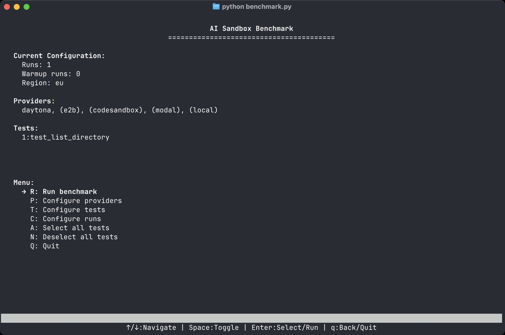

# AI Sandbox Benchmark

[](LICENSE)
[](https://www.python.org/)
[](https://github.com/nkkko/ai-sandbox-benchmark/stargazers)
[](https://github.com/nkkko/ai-sandbox-benchmark/network)
[](https://github.com/nkkko/ai-sandbox-benchmark/issues)
[](CONTRIBUTING.md)
[](https://github.com/nkkko/ai-sandbox-benchmark/graphs/commit-activity)

Welcome to **AI Sandbox Benchmark** – an open-source, standardized benchmarking framework designed to evaluate and compare various code execution sandbox environments like Daytona, e2b, CodeSandbox, Modal, and others.

> **⚠️ Disclaimer:** This project is a work in progress and proof of concept. We are actively working on optimizing performance, improving test coverage, and enhancing the overall user experience. Feedback and contributions are highly welcome!

Whether you're a developer looking to choose the best sandbox for your projects or a contributor aiming to enhance the benchmarking suite, this project is for you!



## 🏃 Quick Start

### Installation

```bash
# Clone the repository
git clone https://github.com/daytonaio/ai-sandbox-benchmark.git
cd ai-sandbox-benchmark

# Set up a virtual environment (recommended)
python -m venv venv
source venv/bin/activate  # On Windows: venv\Scripts\activate

# Install dependencies
pip install -r requirements.txt

# Configure providers
# See providers/README.md for detailed setup instructions
```

### Running Benchmarks

The easiest way to run benchmarks is using the interactive Terminal UI:

```bash
python benchmark.py
```

## ✨ Features

- **Parallel Provider Execution**: Tests run simultaneously across all selected providers
- **Interactive TUI**: User-friendly terminal interface for selecting tests and providers
- **WCAG-Compliant Interface**: High-contrast, accessible terminal UI
- **Automated CodeSandbox Detection**: Warns if CodeSandbox service is not running
- **Flexible Test Configuration**: Run any combination of tests and providers
- **Comprehensive Metrics**: Detailed timing for workspace creation, execution, and cleanup
- **Statistical Analysis**: Mean, standard deviation, and relative performance comparisons
- **Warmup Runs**: Configurable warmup runs to ensure stable measurements

## ⚡ Performance Comparison Example

A basic performance test running the ls command across different providers. The test included one warmup run followed by three timed executions for measurement.

```
================================================================================
                           Test Configuration Summary
================================================================================
Warmup Runs: 1
Measurement Runs: 3
Tests Used (1): 1:test_list_directory
Providers Used: daytona, e2b, codesandbox, modal
================================================================================


Performance Comparison for Test 1: test_list_directory
+--------------------+-------------------+--------------------+---------------------+---------------------+
| Metric             | Daytona           | E2b                | Codesandbox         | Modal               |
+====================+===================+====================+=====================+=====================+
| Workspace Creation | 168.66ms (±6.83)  | 646.40ms (±259.36) | 1533.00ms (±472.06) | 528.03ms (±42.06)   |
+--------------------+-------------------+--------------------+---------------------+---------------------+
| Code Execution     | 366.90ms (±76.72) | 267.24ms (±4.63)   | 190.67ms (±4.03)    | 477.98ms (±190.28)  |
+--------------------+-------------------+--------------------+---------------------+---------------------+
| Cleanup            | 145.81ms (±1.49)  | 738.66ms (±194.46) | 5314.00ms (±62.03)  | 3448.28ms (±215.71) |
+--------------------+-------------------+--------------------+---------------------+---------------------+
| Total Time         | 681.37ms          | 1652.31ms          | 7037.67ms           | 4454.29ms           |
+--------------------+-------------------+--------------------+---------------------+---------------------+
| vs Daytona %       | 0%                | +142.5%            | +932.9%             | +553.7%             |
+--------------------+-------------------+--------------------+---------------------+---------------------+
```

## 📈 Metrics & Performance Tracking

AI Sandbox Benchmark collects detailed performance metrics across providers and offers robust historical tracking:

### Core Metrics

- **Workspace Creation Time**: Time taken to initialize the sandbox environment
- **Code Execution Time**: Time to execute the test code
- **Cleanup Time**: Time required to tear down resources
- **Total Time**: Overall end-to-end performance

### Historical Performance Tracking

The benchmark suite now includes performance history tracking that:

- **Stores Results**: Automatically saves benchmark results to a history file
- **Tracks Trends**: Analyzes performance changes over time
- **Detects Changes**: Identifies improvements or regressions between runs
- **Compares Providers**: Shows relative performance across providers

### Advanced Analysis

- **Statistical Metrics**: Standard deviation, coefficient of variation, min/max values
- **Provider Comparisons**: Identifies fastest and most consistent providers
- **Reliability Tracking**: Tracks error rates and failures over time
- **Performance Trends**: Visualizes performance changes with percentage improvements

### Future Enhancements

- Comprehensive network performance metrics
- Graphical visualization of performance trends
- Automated regression detection and alerting


## 🛠 Installation

### Prerequisites

- **Python 3.12+**
- **Node.js** (for CodeSandbox service)
- **Git**

### Steps

1. **Clone the Repository**

   ```bash
   git clone https://github.com/nkkko/ai-sandbox-benchmark.git
   cd ai-sandbox-benchmark
   ```

2. **Set Up a Virtual Environment (Optional but Recommended)**

   ```bash
   python -m venv venv
   source venv/bin/activate
   ```

3. **Install Python Dependencies**

   ```bash
   pip install -r requirements.txt
   ```

4. **Set Up Provider-Specific Requirements**

   Some providers require additional setup. See the [Provider README](/providers/README.md) for detailed setup instructions.

5. **Configure Environment Variables**

   Create a `.env` file in the root directory with the necessary API keys. Refer to the [Provider README](/providers/README.md) for detailed instructions on setting up each provider.

6. **Configure Sandbox Settings (Optional)**

   The `config.yml` file allows you to customize various aspects of the benchmark, including which environment variables are passed to sandbox environments:

   ```yaml
   # Environment variables to pass to sandboxes
   env_vars:
     pass_to_sandbox:
       - OPENAI_API_KEY
       # Add other variables as needed

   # Test configuration
   tests:
     warmup_runs: 1
     measurement_runs: 10

   # Provider-specific settings
   providers:
     daytona:
       default_region: eu
   ```

## 🏃 Usage

### Available Tests

The benchmark includes the following tests:

1. **Calculate Primes** - Calculates the first 10 prime numbers, their sum and average
2. **Improved Calculate Primes** - Optimized version of the prime calculation test
3. **Resource Intensive Calculation** - Runs CPU, memory, and disk-intensive tasks to stress test the environment
4. **Package Installation** - Measures installation and import time for simple and complex Python packages
5. **File I/O Performance** - Benchmarks file operations with different file sizes and formats
6. **Startup Time** - Measures Python interpreter and library startup times
7. **LLM Generated Primes** - Generates code using an LLM to calculate prime numbers
8. **Database Operations** - Tests SQLite database performance for various operations
9. **Container Stability** - Measures stability under combined CPU, memory, and disk load
10. **List Directory** - Basic system command execution test using ls command
11. **System Info** - Gathers detailed system information about the environment
12. **FFT Performance** - Benchmarks Fast Fourier Transform computation speed
13. **FFT Multiprocessing Performance** - Tests FFT computation with parallel processing
14. **Optimized Example** - Demonstrates optimized code execution patterns
15. **Sandbox Utils** - Tests utility functions specific to sandbox environments
16. **Template** - Template for creating new tests

### Run Benchmarks

You can run benchmarks using either the command-line interface or the interactive Terminal UI.

#### 1. Terminal User Interface (Recommended)

The benchmark TUI provides an interactive way to select tests and providers:

```bash
python benchmark.py
```

#### 2. Command-Line Interface

Execute the comparator script directly for command-line benchmarking:

```bash
python comparator.py
```

To use the CLI mode with the TUI script:

```bash
python benchmark.py --cli
```

#### Available Options

- `--tests` or `-t`: Comma-separated list of test IDs to run (or `"all"`).
  **Default:** `all`

- `--providers` or `-p`: Comma-separated list of providers to test.
  **Default:** `daytona,e2b,codesandbox,modal,local`

- `--runs` or `-r`: Number of measurement runs per test/provider.
  **Default:** `10`

- `--warmup-runs` or `-w`: Number of warmup runs.
  **Default:** `1`

- `--target-region`: Target region (e.g., `eu`, `us`, `asia`).
  **Default:** `eu`

- `--show-history`: Show historical performance comparison.
  **Default:** Disabled (flag to enable)

- `--history-limit`: Number of previous runs to include in history.
  **Default:** `5`

- `--history-file`: Path to the benchmark history file.
  **Default:** `benchmark_history.json`

#### Examples

- **Run All Tests on All Providers**

  ```bash
  python comparator.py
  ```

- **Run Specific Tests on Selected Providers**

  ```bash
  python comparator.py --tests 1,3 --providers daytona,codesandbox
  ```

- **Run Tests on Local Machine Only**

  ```bash
  python comparator.py --providers local
  ```

- **Increase Measurement and Warmup Runs**

  ```bash
  python comparator.py --runs 20 --warmup-runs 2
  ```

- **View Historical Performance Trends**

  ```bash
  python comparator.py --tests 1 --show-history
  ```

- **Compare Recent Performance with History**

  ```bash
  python comparator.py --tests 1,2 --providers daytona,e2b --show-history --history-limit 10
  ```

- **Use Custom History File**

  ```bash
  python comparator.py --tests 1 --history-file custom_history.json --show-history
  ```

### Parallel Provider Testing

The benchmark suite now runs tests on all selected providers in parallel, significantly reducing overall benchmark time. Each test will be executed on all providers simultaneously, rather than waiting for each provider to finish before moving to the next one.

## 🚀 Get Involved

We invite developers, testers, and enthusiasts to contribute by adding new tests or integrating additional sandbox providers. Your contributions help make AI Sandbox Benchmark a comprehensive and reliable tool for the community.

Check out our [Contributing Guidelines](CONTRIBUTING.md) to get started!

## 📄 License

This project is licensed under the [Apache 2.0 License](LICENSE).

## 🙏 Credits

- **Sandbox Providers:** See the [Provider README](/providers/README.md) for details on all supported providers

- **Libraries and Tools:**
  - [LangChain](https://langchain.com/)
  - [OpenAI](https://openai.com/)
  - [NumPy](https://numpy.org/)
  - [Tabulate](https://github.com/astanin/python-tabulate)
  - [Curses](https://docs.python.org/3/library/curses.html) (Terminal UI)
  - [Dotenv](https://github.com/theskumar/python-dotenv)
  - [Termcolor](https://pypi.org/project/termcolor/)
  - [Requests](https://requests.readthedocs.io/)
  -